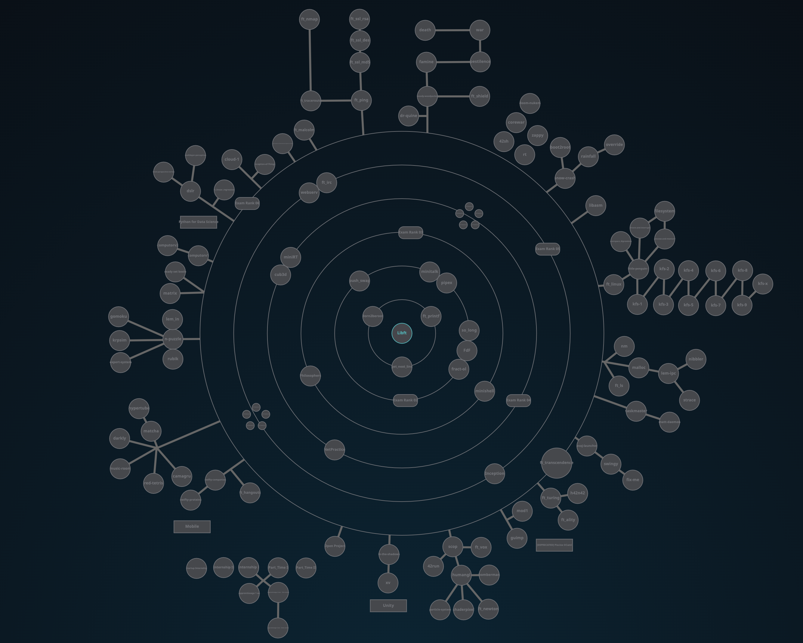

<h1 align="center">
  42-cursus
</h1>

  <b><i>Proyectos desarrollados en <a href="https://www.42malaga.com/">42 Málaga</a></i></b> 
  Fecha de inicio: 17/04/2023

	
	
	
	
	

<h3 align="center">
  <a href="#%EF%B8%8F-sobre-42">Sobre 42</a>
	 · 
	<a href="#%EF%B8%8F-habilidades-desarrolladas-en-42cursus">Habilidades desarrolladas en 42cursus</a>
	 · 
	<a href="#-42s-galaxy-curriculum">42's galaxy (curriculum)</a> 
</h3>

## 🗣️ Sobre 42

	42 es una iniciativa de educación global que propone una nueva forma de aprender tecnología: sin profesores,
	sin aulas, estudiantes aprendiendo de sus compañeros (peer to peer learning), con una metodología
	que desarrolla habilidades informáticas y para la vida. El cursus 42 es gratuito para quien sea
	aprobado en su proceso de selección. El llamado "C Piscine" - convirtiéndose así en alumnos de 42.

\* Para obtener más información sobre el **proceso de selección** de 42 (la "Piscina"), visite el [repositorio de C Piscine](https://github.com/Selio30/42-piscine)

## 🛠️ Habilidades desarrolladas en 42cursus

### Hard-skills

	* C/C++ language, Makefile
	* Shell scripting
	* Git
	* Networks
	* Docker
	* SQL
	* Web (HTML, CSS, Wordpress)
	* Computer graphics
	* Assembly language

-- entre otros (encuentre a continuación el [plan de estudios](#-42s-galaxy-curriculum)).

### Soft-skills

    # Autoaprendizaje y proactividad
            En 42, el autoaprendizaje es el núcleo de su metodología de aprendizaje entre pares.
            No hay profesores en absoluto; el proceso de aprendizaje se basa en googlear, preguntar
            a tus compañeros y asistir a clases que los propios alumnos convocan. Así, aunque cada
            alumno aprenda a su propio ritmo, nadie se queda atrás.

    # Trabajo en equipo
            Los fines de semana se propone un proyecto en equipo de 48h llamado "Rush": un grupo de
            3 o 4 miembros elegidos al azar por el sistema de la escuela debe desarrollar en colaboración
            una aplicación completamente operativa. El gran desafío aquí es igualar los diferentes niveles
            de conocimiento y encontrar una metodología de trabajo común que permita a todos los
            miembros del equipo contribuir al proyecto.

    # Gestión del tiempo y resiliencia
            La escuela está abierta 24/7. Así, los llamados "pisciners" son libres de trabajar cuando lo
            deseen, lo que exige una excelente gestión del tiempo y resilencia para no "ahogarse" en medio
            de la enorme carga de trabajo que exige el programa de 26 días sin parar.

## 🌌 42's galaxy (curriculum)

**42cursus** comprende dos grupos de proyectos: el primero se conoce como _"inner circle"_ y el segundo _"outer treks"_ - debido al diseño de **Holy Graph** (ver imagen a continuación).

El **círculo interno** es el plan de estudios básico, siendo obligatorio que todos los proyectos alcancen el nivel 7, que es el nivel mínimo requerido para actividades como pasantías e intercambio.

**Outer treks** es una colección de diversas rutas de proyectos en temas que van desde sistemas operativos hasta desarrollo web, lo que permite a los cadetes especializarse en cualquier tema que prefieran.

La siguiente tabla presenta el plan de estudios del cursus en el orden cronológico en el que fue (o será) completado por mí; el orden de los proyectos y el nivel alcanzado correspondiente pueden variar entre los estudiantes.

|CIRCLE	|PROJECT							|TECHNOLOGY				|EXPERIENCE		|STATUS						|ATTAINED LEVEL	|
|:-:	|:--								|:--					|--:			|:-:						|:--			|
|00		|[Libft](https://github.com/Selio30/42-libft)|C						|462 XP			|125% :heavy_check_mark:							|level 1 - 05%				|
|:dizzy:|									|						|**= 462 XP**	|							|				|
|01		|[ft_printf](https://github.com/Selio30/42-printf)|C						|882 XP			|							|				|
|01		|netwhat		|Networks				|462 XP			|							|				|
|01		|get_next_line|C						|882 XP			|							|				|
|:dizzy:|									|						|**= 2.226 XP**	|							|				|
|02		|ft_server|docker, .sh, web, SQL	|1.722 XP		|							|				|
|02		|miniRT or cub3d	|C, Computer Graphics	|4.620 XP		|							|				|
|02		|Exam Rank 02						|-						|0 XP			|							|				|
|:dizzy:|									|						|**= 10.962 XP**|							|				|
|03		|libasm								|Assembly				|966 XP			| |
|03		|minishell							|C						|2.814 XP		|							|				|
|03		|ft_services						|docker, Kubernetes		|1.008 XP		|							|				|
|03		|Exam Rank 03						|-						|0 XP			|							|				|
|:dizzy:|									|						|**= 4.788 XP**	|							|				|
|04		|Philosophers						|C						|3.360 XP		|							|				|
|04		|CPP Modules (9)					|C++					|9.660 XP		|							|				|
|04		|Exam Rank 04						|-						|0 XP			|							|				|
|:dizzy:|									|						|**= 13.020 XP**|							|				|
|05		|ft_containers						|C++					|5.796 XP		|							|				|
|05		|webserv							|C++					|17.304 XP		|							|				|
|05		|ft_irc								|C++					|17.304 XP		|							|				|
|05		|Exam Rank 05						|-						|0 XP			|							|				|
|:dizzy:|									|						|**= 40.404 XP**|							|				|
|06		|ft_transcendence					|?						|24.360 XP		|							|				|
|06		|Exam Rank 06						|-						|0 XP			|							|				|
|:dizzy:|									|						|**= 24.360 XP**|							|				|
